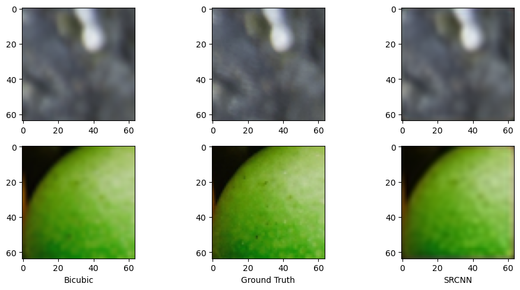
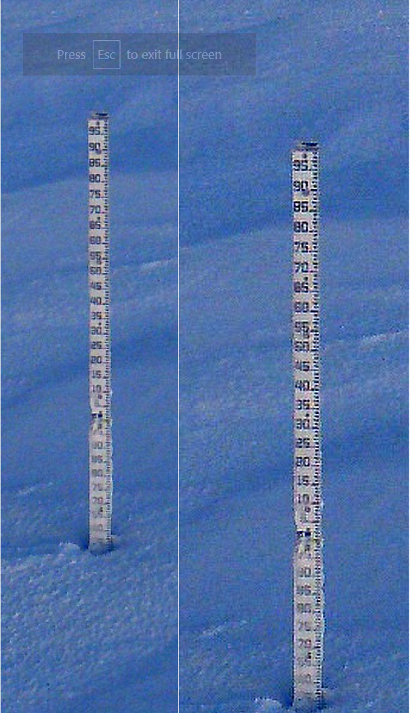

## Introduction
Hello! My name is Alex Arnold and I am a rising senior studying computer science and cogntiive science at Northwestern University. This summer I looked at using super resolution methods to improve the quality of images for both humans and machines to analyze. 

## Motivation
Images from the cameras on nodes can often be blurry or in unideal conditions, and the most important parts of these images can be in small sections of the images such as rideshare stickers. When scaled up through conventional means, these images turn out to be incredibly blurry. Text is an especially heinous offender, as it can be near impossible to read. Text like "Uber" or "Lyft" contains the most important information and needs to be as easily accessibly as possible. Measuring sticks are also often hard to read by humans when they are small or farther back in the image. A few sites have measuring sticks for water or snow depth that are less than accurate when viewing just a picture.

By accurately scaling up these images it could make them easier to analyze for other research. The problem is, super resolution is inherently "ill-formed" as multiple high resolution images map to single low resolution image. For very low res images, multiple words or numbers could be proper outputs given only the low-resolution image which makes this work inredibly challenging to get right. This field is still being actively researched and models are known to hallucinate or slightly change the original image. These models should not be used for high-risk scenarios quite yet, but hopefully one day they will be ready!

## Convolutional Networks and SCRNN
Although some approaches have used transformers convolutional networks arethe most common network architecture for super resolution tasks. CNNs are especially good at capturing spatial relationships and are used for most image problems in deep learning. One simple architecture is SRCNN [2], which is a simple architecture of just three layers. Since it is a fully convolutional network, it can accept images of any size or shape and has relatively few parameters which is ideal for edge computing. However, it does require a preprocessing step known as bicubic interpolation and is not end-to-end. This changes the low resolution image to the desired size, and then the network sharped and refines the image from there. 

I was able to get results that were similar to the original paper by training on the popular DIV2K [3] dataset, but the most important thing for super resolution is actually just the "eye-test." The images didn't look particularly clear compared to the original ground truth image, and they actually looked worse than a simple bicubic interpolation. This could have been due to lack of training time, but given the already long process I decide to look for a better solution.

I also used a different dataset of street signs [5], as those are more similar to the types of images we would see on the nodes picking up rideshare stickers. They also have the added benefit of including more text and numbers (something the DIV2K dataset was lacking). This dataset performed similarly to the previous dataset which meant that a completely different approach was needed.

## Zero Shot Super Resolution
Zero shot super resolution [1] is a very different approach to the problem, as instead of training on a large external dataset it trains on one singular image at test time. This means it is a "self-supervised model," something I had never heard of until this project. Unlike most models, it doesn't require a large dataset or even labels. Instead, the model creates its own dataset by augmenting the original image in a variety of ways to mimic the many ways an image good be degraded or compressed in the real world. The images are then downscaled into lower resolution images, and a model is trained to turn the new lower resolution images into the original image. The idea is that there are many repeating patterns within the image that model can learn and apply to turning the low resolution image into the unknown target super resolution image. This one is a little more complicated than SRCNN, but luckily I was able to utilize pre-implemented models to test it out.

There isn't a way to numerically test this model's performance on the images collected from the nodes as we don't have the corresponding high res image, but prelimary results are promising. Upscaled pictures of rideshare stickers and measuring sticks are clearer to an extent, especially the numbers that were alerady relatively clear. However, if the text or numbers were especially blurry the model wasn't able to figure out and correct them. For example, particularly blurry Uber stickers still just looked like blurry text at the end of the day. However, these results are still a promising start. Additionally, ZSSR is a particularly slow method as it can require hundreds of gradient updates for each image as it trains a new model from scratch each time. Another improved method called MZSR [4] is based on ZSSR, but it also leverages a large dataset to get better intial parameters to reduce the number of gradient descents needed. This would require more initial training time (compared to zero for ZSSR), but testing time would be greatly reduced. 

## Use for Object Detection

The other use case I tested was for detecting rideshare stickers. Another project this summer worked on training a YOLOv8 model to detect rideshare stickers on cars and had already been running for several weeks to generate a dataset of potential new rideshare stickers. I hypothesized that due the super resolution would be able to either recreate features of the stickers or make the already available features easier for the model to detect. This is should lead to the model having higher confidence scores that an object either is or isn't a rideshare sticker. I used ZSSR to create copies of the images with twice the resolution and used the same model for each to see if the confidence of predictions changed. Unfortunately, the confidence of the model was almost identical regardless. Good news is, the super resolution process didn't seem to degrade the information in the image but it also didn't improve performance. 

## What's next?
One major problem that could be at play here is how object detection models tend to be trained. Models work best when trained on a specific image size, which means the models were best when the input images are that size even when the model could accept any size. If these models were to be retrained on larger images they may be able to fully utilize these larger super resolution images in a way current models can't. In it's current state these methods aren't quite ready for deployment, but with all the recent advances in super resolution it could be here soon!

## References
[1] A. Shocher, N. Cohen and M. Irani, "Zero-Shot Super-Resolution Using Deep Internal Learning," 2018 IEEE/CVF Conference on Computer Vision and Pattern Recognition, Salt Lake City, UT, USA, 2018, pp. 3118-3126, doi: 10.1109/CVPR.2018.00329.

[2] C. Dong, C. C. Loy, K. He and X. Tang, "Image Super-Resolution Using Deep Convolutional Networks," in IEEE Transactions on Pattern Analysis and Machine Intelligence, vol. 38, no. 2, pp. 295-307, 1 Feb. 2016, doi: 10.1109/TPAMI.2015.2439281.SRCNN paper

[3] E. Agustsson and R. Timofte, "NTIRE 2017 Challenge on Single Image Super-Resolution: Dataset and Study," 2017 IEEE Conference on Computer Vision and Pattern Recognition Workshops (CVPRW), Honolulu, HI, USA, 2017, pp. 1122-1131, doi: 10.1109/CVPRW.2017.150.

[4] J. W. Soh, S. Cho and N. I. Cho, "Meta-Transfer Learning for Zero-Shot Super-Resolution," 2020 IEEE/CVF Conference on Computer Vision and Pattern Recognition (CVPR), Seattle, WA, USA, 2020, pp. 3513-3522, doi: 10.1109/CVPR42600.2020.00357.

[5] make ml, Road Signs Dataset, Make ML, https://makeml.app/datasets/road-signs%7D