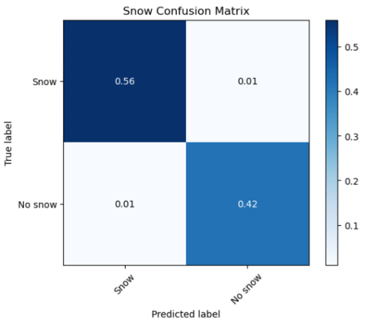
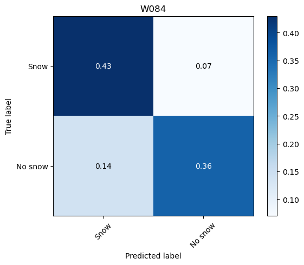

# Snow classifier

Ice and snowfall are incredibly important parts of a river ecosystem. The Bad River is home to wild rice, which is very temperamental and prone to natural boom/bust years. Having a snow classifier can be used to create a larger dataset of snow that can be used for a variety of these additional tasks including assisting with predicting wild rice yields.

## The Data
Two Waggle/Sage nodes were collecting both images and other data from the Bad River in 2022-2023 winter. The one node (W014) was collecting data in 2022 up until December when it went offline, in January a second node (W083) started collecting images pointing at essentially the same spot. This gave me a collection of 3500 images to work with. About half of them had snow of some kind and half did not so there weren't any major class imbalance problems. One of the big decisions we had to make was when to count an image as having snow. Did a few patches count? Did a light dusting of snow count? In the end, we elected to count _any_ snow on the ground to simplify the problem. The two images below are from W014 and W083 respectively.

   

The nodes took a picture once every hour, so some images were at night and too dark to see. Images where we couldn't discern whether there was snow or not (snow fell at night at an unclear time) were discarded from the dataset. Darker images were still included if we could confirm that they contained snow. 

## Approach

First, the images needed to be preprocessed and transformed. One problem snow detection runs into is the similarity between snow and clouds. Unsupervised methods based on color often classify clouds as also being snow, but this issue is solved through the use of deep learning and some more heavy-handed techniques. Neural networks can learn not to depend only on color but instead on other information such as texture. To help the network along we also cropped out the sky from the images in addition to other transforms such as solarization. Solarization randomly reverses the brightness of pixels over a certain threshold so it cannot depend on which pixels are very bright. These changes force the model to learn to recognize snow on the ground through additional attributes in addition to color.

Our goal was to create a machine-learning model that could detect whether there was snow on the ground around the river. Convolutional neural networks are the main tool of choice for these kinds of image related tasks. They work by using a sliding "window" across an image to capture relationships and patterns between pixels across the image. This sliding window approach reduces the number of parameters and complexity of the model. There are already a multitude of pre-trained convolutional network models out there that perform well on image classification tasks, but there aren't any deep learning models trained specifically for snow detection. _transfer learning_ comes to the rescue to make training a new model incredibly easy with limited time and computational power. 

Transfer learning works by taking an image classification model that someone else has already taken the time to train reusing it for a new purpose. We utilized ResNet50 [1], a popular convolutional neural network model that pioneered a technique called residual connections. Residual connections allow neural networks to optimize quickly while still being deep enough to capture complex relationships. ResNet50 is a very deep network with fifty layers (hence the name) and would take a lot of time and computing power to train even with the residual connections, but some free pre-trained models are essentially plug-and-play with only small modifications. A visualization of ResNet50's architecture is seen below [2].

The theory behind transfer learning is that ResNet50 has already learned to encode certain aspects of an image that are generalizable, so all it needs is a few changes to use those lower-level features to create a new prediction. To turn the model into a snow detector, we tacked on a couple of extra linear layers at the end to generate a prediction score for whether there is snow or not. This vastly sped up training time compared to creating a whole new model.

## Results
The classifier was able to detect snow incredibly accurately from images collected from W014 and W083 (left confusion matrix). However, we wanted to ensure that the model wasn't completely overfitting to the images from these nodes and was learning something about snow. We also tested it on images from a node in Montana (W084). It didn't perform quite as well but still performed accurately enough to indicate that it wasn't overfitting horrendously (right confusion matrix). That being said, currently, the plugin is released to be used at the Bad River W083 node as it's not fit to be a general snow classifier quite yet.

   

## Future Steps

We weren't able to get additional data from the Bad River, but additional work could look at using these images to predict turbidity data and other information about the river. This could be used to facilitate and predict wild rice yields as well. More data from other Waggle/Sage nodes could also be used to create a more general snow classifier that could be used at other locations with more confidence, but for now it's best only at the Bad River site. 

## Citations
[1] K. He, X. Zhang, S. Ren, and J. Sun, “Deep residual learning for image recognition,” 2016 IEEE Conference on Computer Vision and Pattern Recognition (CVPR), 2016. doi:10.1109/cvpr.2016.90 

[2] https://commons.wikimedia.org/wiki/File:ResNet50.png
