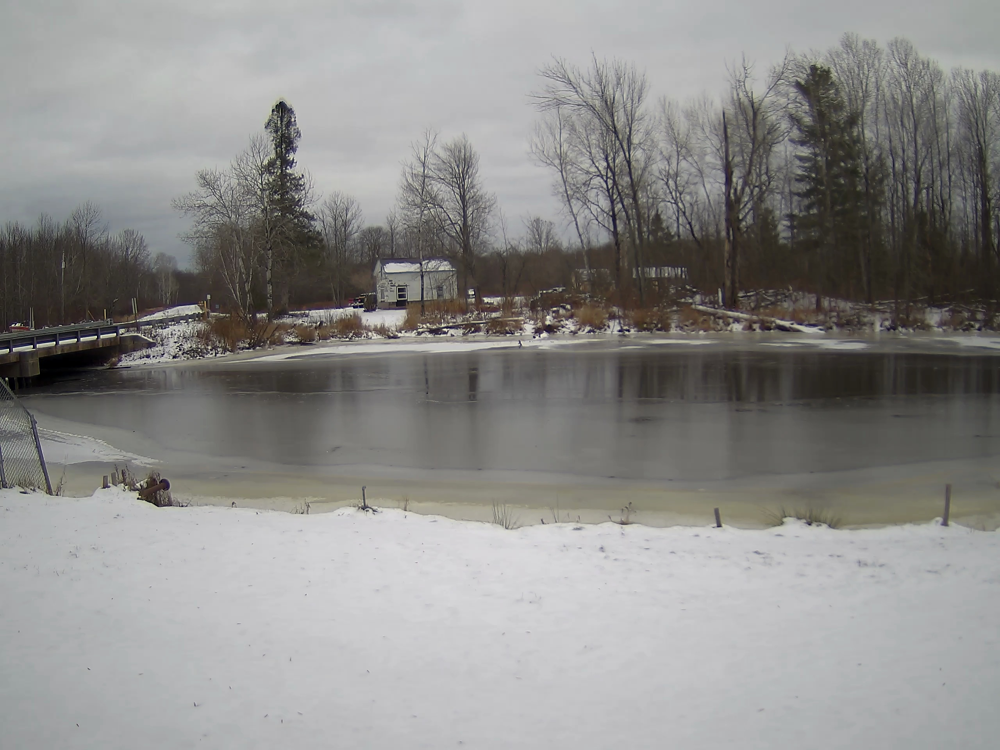
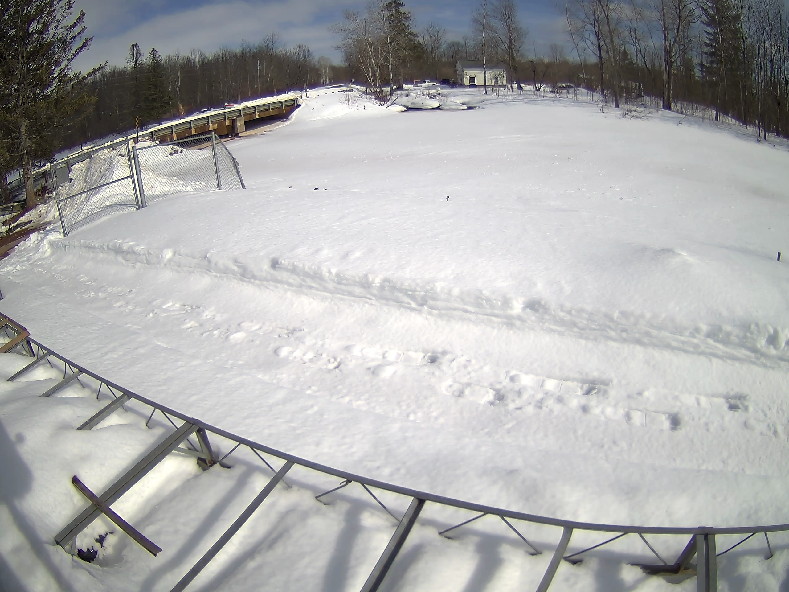
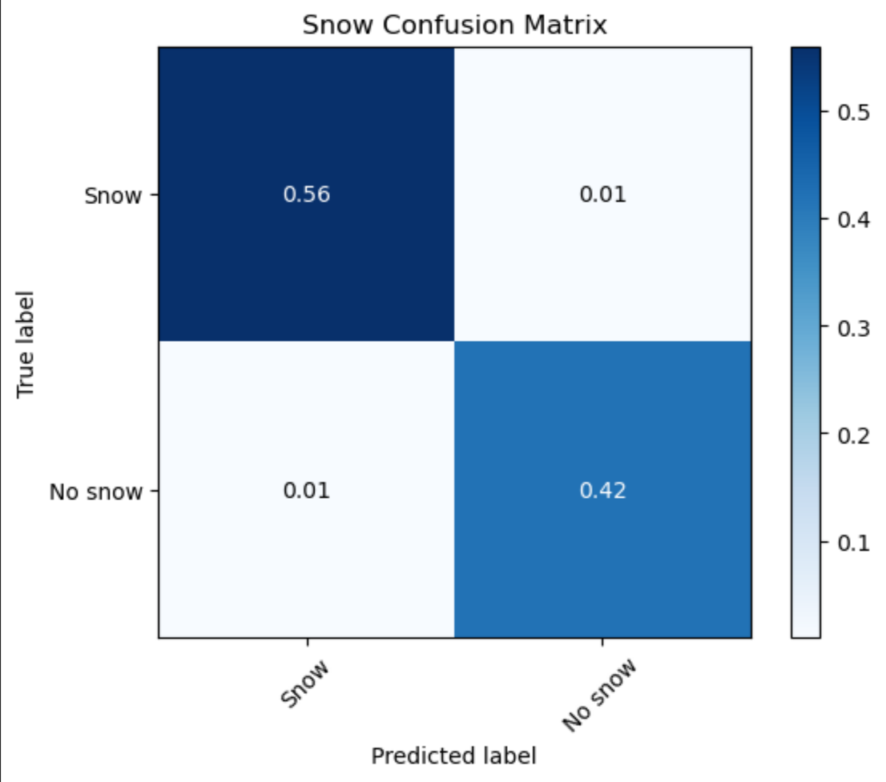

## Introduction
Hello! My name is Alex Arnold and I am a rising senior studying computer science and cogntiive science at Northwestern University. This summer I worked with the Sage team to analyze images from the Bad River site in northern Wisconsin. Ice and snowfall are incredibly important parts of a river ecosystem. The Bad River is home to wild rice, which is a very tempramental. Having a snow classifier can be used to create a larger dataset for snow that can be used for these purposes.

## The Data
Two waggle nodes were collecting both images and other data from the Bad River in the past year. The W014 waggle node was collecting data in 2022 up until December when it went offline, In January a second node (W083) started collecting images pointing at essentially the same spot. This gaves me a collection of 3500 images to work with. Luckily about half of them had snow of some kind and half didn't so there weren't any major class imbalance problems. 

The nodes took a picture once every hour, so some images were at night and too dark to see. Images where it couldn't discerned whether there was snow or not (snow fell at night at an unclear time) were discarded from the dataset. Darker images were still included if I could confirm that they contained snow.

## Approach

First, the images needed to be preprocessed and transformed. One problem snow detection runs into is the similarity between snow and clouds. Unsupervised methods based on color often classify clouds as also being snow, but this issue is solved through the use of deep learning and some more heavy handed techniques. Neural networks (hopefully) are able to learn not to depend only on color and instead on other information such as texture. To help the network just a little bit, I also just cropped out the sky from the images in addition to other transforms such as solarization, which randomly reverses the brightness of of pixels over a certain threshold. These changes force the model to learn to recognize snow on the ground through additional attributes in addition to color.

Our goal was to create a machine learning model that could detect whether there was snow on the ground around the river. Convolutional neural networks are the main tool of choice for these kind of tasks. They work by using a sliding "window" across an image to capture relationships and patterns between pixels across the image. There are already a multitude of pretrained convolutional network models out there that perform well on object detection tasks, but there aren't any deep learning models trained specifically for snow detection. Luckily _transfer learning_ comes to the rescue to make training a new model incredibly easy with limited time and computational power. 

Transfer learning works by taking an object detection model that someone else has already taken the time to train reusing it for a new purpose. I utilized ResNet50 [1], a popular convolutional neural network model that pioneered a technique called residual connections. Residual connections allow neural networks optimize more easily and quickly while still being deep enough to capture complex relationships. ResNet50 is a very deep network with fifty layers (hence the name) and would take a lot of time and computing power to train even with residual connections, but luckily there are free pretrained models that are essentially plug and play with some small modifications. A visualization of ResNet50's architecture is seen below [2].

The theory behind transfer learning is that ResNet50 has already learned to encode certain aspects of an image  that are generalizable, so all it needs is a few changes to use those lower level features to create a new prediction. To turn the model into a snow detector, I tacked on a couple extra linear layers at the end to generate a prediciton score for whether there is snow or not. This vastly sped up training time compared to creating a whole new model.

## Results
The classifier was able to detect snow incredibly accurately from images collected from W014 and W083.

However, we wanted to ensure that the model wasn't completely overfitting to the images from these nodes and was actually learning something about snow. I also tested it on images from a node in Montana (W084). It didn't perform quite as well, but still performed accurately enough to indicate that it wasn't totally overfitting That being said, currently the plugin is released to be used at the Bad River W083 node as it's not fit to be a general snow classifier quite yet.

## Future Steps

Sadly we weren't able to get additional data from the Bad River, but additional work could look at using these images to predict turbidity data and other information about the river. This could be used to facilitate and predict wild rice yields as well. More data from other waggle nodes could also be used to create a more general snow classifier that could be used at other locations with more confidence, as for now it's best only at the Bad River site. 

## Citations
[1] K. He, X. Zhang, S. Ren, and J. Sun, “Deep residual learning for image recognition,” 2016 IEEE Conference on Computer Vision and Pattern Recognition (CVPR), 2016. doi:10.1109/cvpr.2016.90 

[2] https://commons.wikimedia.org/wiki/File:ResNet50.png
