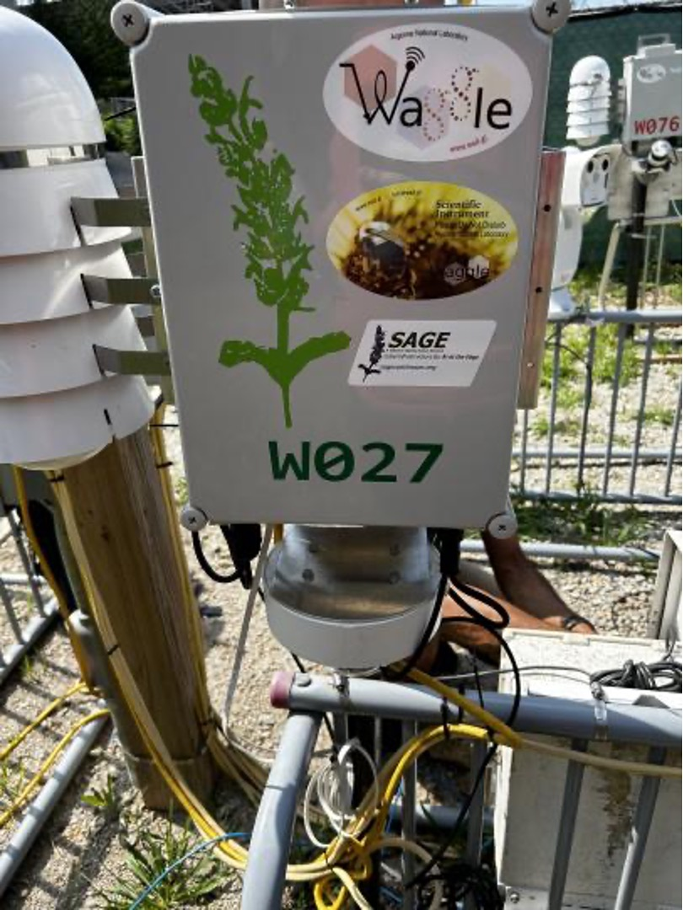
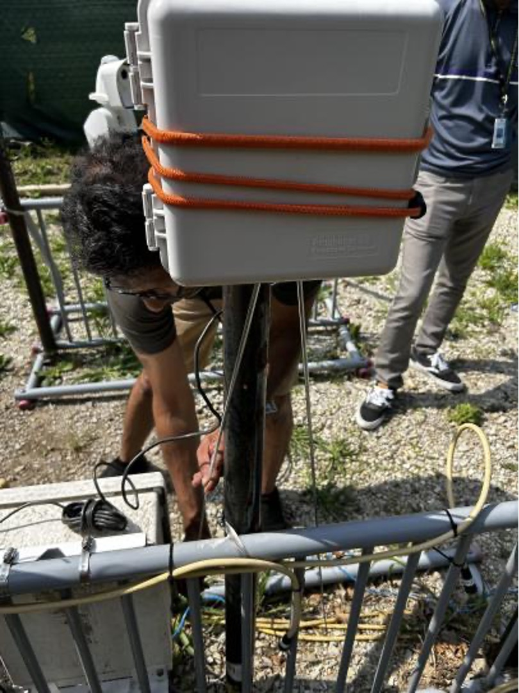
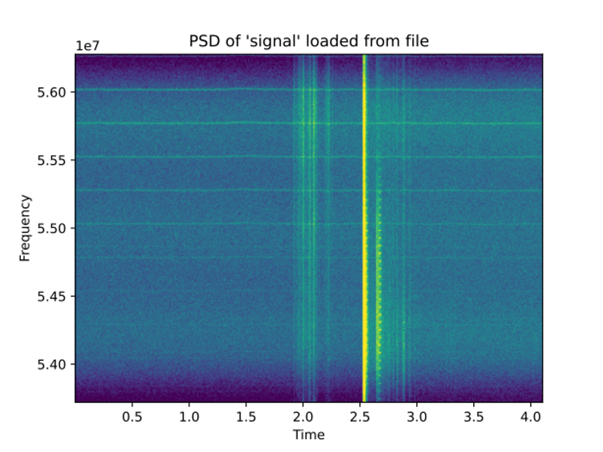

# Lightning Detection with Software Defined Radio

Lightning causes significant damage, starts wildfires, and poses a threat to human safety. Lightning strike releases a large pulse of electromagnetic energy that can be detected and recorded with software-defined radio (SDR). These recordings can be used to:
- Determine the location of a lightning strike by using the time of arrival method.
- May be able to determine the type of lightning. Positive cloud to ground lightning discharge are likely to cause fire
Additionally, the data collected by SDR is collected at about 10 MB/s making it essential to only record specific batches of data.

## How Lightning is Created

According to the article that NWS provides[1], the conditions needed to produce lightning have been known for some time. However, exactly how lightning forms has never been verified so there is room for debate. Leading theories focus around separation of electric charge and generation of an electric field within a thunderstorm. Recent studies also indicate that ice, hail, and semi-frozen water drops known as graupel are essential to lightning development. Storms that fail to produce large quantities of ice usually fail to produce lightning.

### Charge Separation

Thunderstorms have very turbulent environments. Strong updrafts and downdrafts occur with regularity and within close proximity to each other. The updrafts transport small liquid water droplets from the lower regions of the storm to heights between 35,000 and 70,000 feet, miles above the freezing level. Meanwhile, downdrafts transport hail and ice from the frozen upper regions of the storm. When these collide, the water droplets freeze and release heat. This heat in turn keeps the surface of the hail and ice slightly warmer than its surrounding environment, and a "soft hail", or "graupel" forms. When this graupel collides with additional water droplets and ice particles, a critical phenomenon occurs: Electrons are sheared off of the ascending particles and collect on the descending particles. Because electrons carry a negative charge, the result is a storm cloud with a negatively charged base and a positively charged top.

When that charge threshold is reached, the strength of the electric field overpowers the atmosphere's insulating properties, and lightning results. The electric field within the storm is not the only one that develops. Below the negatively charged storm base, positive charge begins to pool within the surface of the earth. This positive charge will shadow the storm wherever it goes, and is responsible for cloud-to-ground lightning.

  

Some lightning originates in the cirrus anvil or upper parts near the top of the thunderstorm, where a high positive charge resides. Lightning that forms in this region follows the same scenario as previously described, but the descending stepped leader will carry a positive charge while its subsequent ground streamers will have a negative charge. These bolts are known as "positive lightning" because there is a net transfer of positive charge from the cloud to the ground.

### Danger of Postive Lightning

Positive lightning makes up less than 5% of all strikes. However, despite a significantly lower rate of occurrence, positive lightning is particularly dangerous for several reasons. Since it originates in the upper levels of a storm, the amount of air it must burn through to reach the ground usually much greater. Therefore, its electric field typically is much stronger than a negative strike. Its flash duration is longer, and its peak charge and potential can be ten times greater than a negative strike. Positive flashes are believed to be responsible for a large percentage of forest fires and power line damage. Thus, positive lightning is much more lethal and causes greater damage than negative lightning.

## Approach and Future Directions

In terms of predicting and forecasting wildfire caused by lightning strike, we employed a software-defined radio (SDR) to collect data about negative and postive lightning. So we built a weatherproofed SDR box that could be connected to a Waggle/Sage node. The radio generates 10 MB/s data.

   

As a preliminary result, we were able to recieve a distinguishable signal.

   

We are expecting that we can collect sufficient positive and negative lightning data, so that we can build a process to distinguish them. Additionally, when Waggle/Sage nodes including this SDR are deployed and formed a grid, we will implement a way to triangulate the location of a lighting strike.

## Citations

[1] https://www.weather.gov/source/zhu/ZHU_Training_Page/lightning_stuff/lightning2/lightning_intro.html
