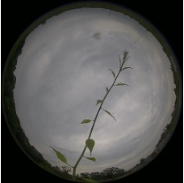
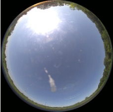
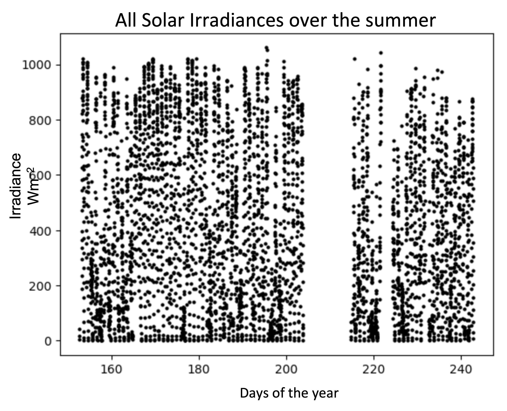

# Solar Irradiance Estimation

Solar energy is one of the cleanest and most renewable sources of energy in today’s day and age. Through the development of this project there can be a vast economic impact in the sense that power grid operators will be able to manage power supply much more efficiently and even begin to automate processes for solar energy generation. We created a model to estimate solar irradiance in the sky based on ground images taken from Waggle/Sage nodes. We are excepting that this application will support:

- Solar energy generation: predicting energy generation more accurately resulting in improved efficiency and grid management
- Weather forecasting: assisting meteorologists in predicting weather patterns using solar irradiance levels, and in analyzing current weather conditions
- Climate change: modeling climate change, could contribute to understanding and assist in mitigating global warming
- Smart Homes: managing energy more efficiently (control certain devices based on irradiance levels) 

## The Data

   
 

A Waggle/Sage node were collecting sky images from Argonne Weather Observatory from 2022 summer. We used images captured on May through August 2022 because of the change of the trajectory of sun and maximum solar irradiance that is changing based on the trajectory. We assumed that the trajectory would not change significantly therefore the solar irradiance would be in relevantly similar range. We used solar irradiance measurement from a sensor deployed on Argonne Weather Observatory as a matching set with the images. The solar irradiance measurement is reported every 15 minute while the node took a picture once every hour. We matched image and measurement data based on their timestamp and this gave us a collection of about 4000 images to work with. Solar irradiance measurement ranges between 1060.7 and -9.74 during May through August 2022, and distribution of them are shown below:

  
 

# Training and Model
In our training, before the image was transformed to a tensor, the image was resized down to 224x224 to stay consistent with the pre-trained models. The image was also randomly flipped with a 50% chance and rotated randomly between 0-359 degrees so the model would be able to generalize better. For our model we compared the  pre-trained ResNet models (ResNet18, ResNet38, and ResNet50) and the VGG-16 model. However we replaced the last fully connected layer so that the model would give us a continuous value as an estimate instead of a range. We found that the ResNet 50 model performed the best with the lowest mean absolute error of 82. Graph on the left is showing the number of times that each margin of error appeared in our testing images. And right is showing the predicted irradiance of the test images against its actual irradiance value. The dots on the right plot are centering mostly around the line of $y=x$, meaning the model is predicting accurately on average. Also since there are points both above and below the line the model is not biased towards either overestimating or underestimating also causing it to predict well on average.

## Future Steps

We can generate solar irradiance models for each month, each season, or each certain length of daytime, when we have accumulated years of data. And these models could better represent of solar irradiance and higher accuracy. Additionally, we are hoping that we can use this for power production estimation and forecast since solar irradiance and solar power production is correlated.
