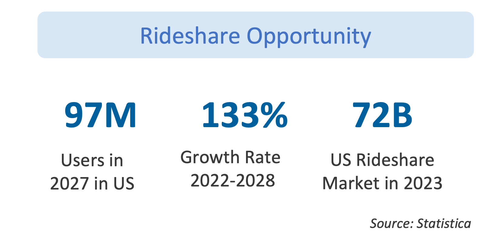
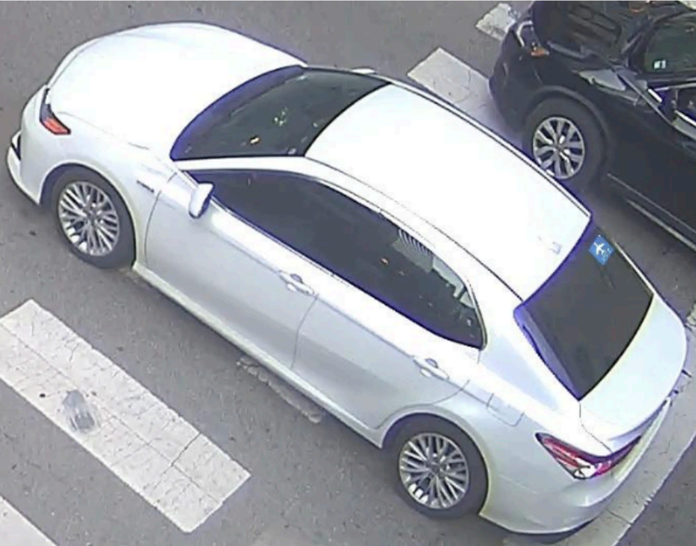
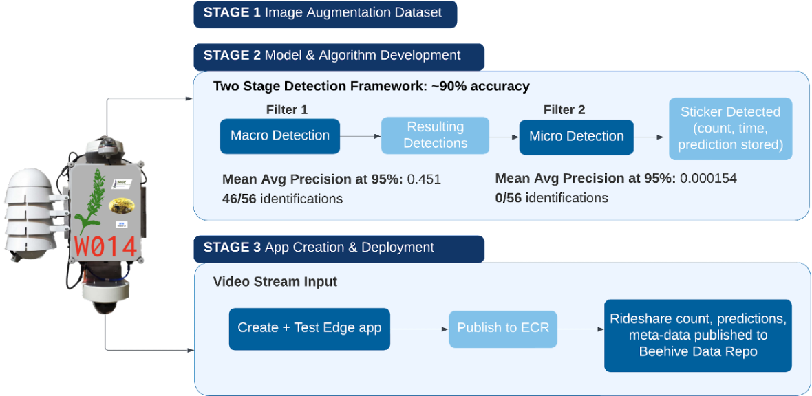
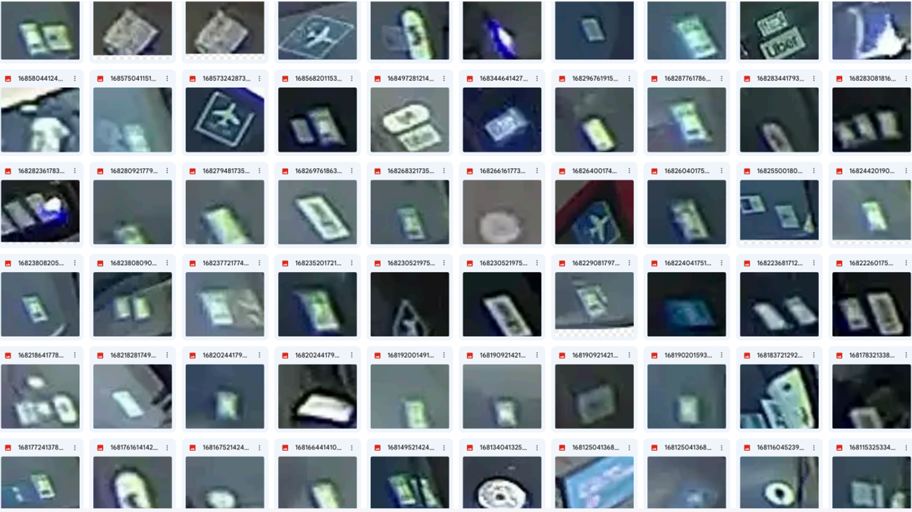
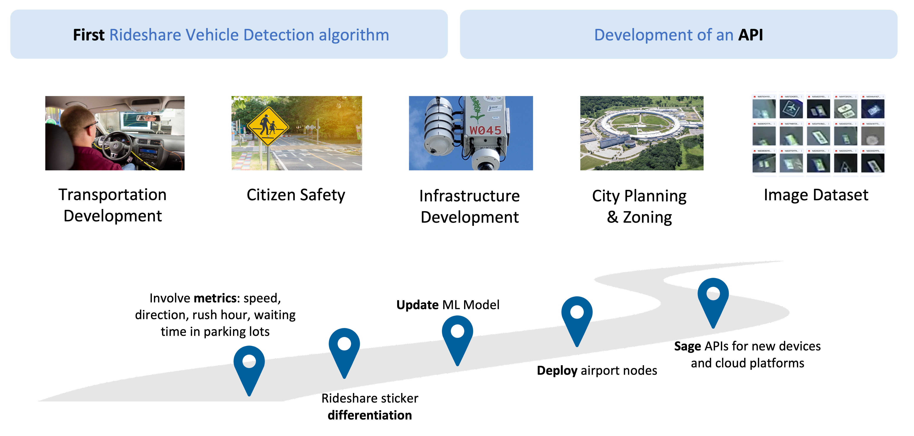

# Rideshare Sticker Detector

  

Rideshare vehicles make more than 15 million trips per day in United States. To understand congestions at areas where large number of people use rideshare services, such as airports, central stations, and conference centers. However, we are facing lack of rideshare vehicle detection algorithm, and only numerical rideshare data are available (miles traveled, gps location, etc), and these information is concealed or expensive. To support understanding proportion of traffic congestion caused by rideshare vehicles at those areas, we explored possibility of rideshare vehicle detection using image identification model. In this project, we employed an object detection model called YOLO (You Only Look Once).

  

## The Data

Because there is no public dataset about rideshare vehicles or rideshare stickers, we created one manually. Waggle/Sage nodes have been collecting images and other data, such as temperature, humidity, presure, and other environmental data, at the city of Chicago. We collected street images from three different nodes deployed at intersections in Chicago. We used a COCO trained YOLO v7 model to detect vehicles and used OpenCV to overlay rideshare stickers on windshield of vehicle images manually. We randomly chose rideshare stickers of Uber, Lyft, and TNP (Chicago Transportation Network Providers) with random opacity, darkness and perspective warp to make the stickers look realistic. This gave us a collection of 2960 images to work with. The nodes took a picture once every hour, so some images were at night and too dark to see. Images where we couldn't discern whether there was on front and side winder were discarded from the dataset.

  

## Approach

We set a two-stage detection framework because of small size and changing light conditions because they make it challenging to detect rideshare stickers. Two-stage model filter system we used for this project, 1) detects vehicles which have high possiblity of recognized as rideshare vehicle using a YOLO v8 model that trained with the dataset we manually generated and crop the vehicles, and 2) confirming presence of rideshare stickers on the vehicles using the same YOLO v8. Because we extracted only part of image where highly impact on determining existance of rideshare sticker from the first stage, we can use comparatively high resolution rideshare sticker images (or vehicle images which would contain a rideshare sticker) as inputs for the second stage, and this increase confidence level of the detection.

  

## Results

  

The detector was able to detect rideshare stickers with about 90% accuracy within the two-stage model. In addition to detect rideshare stickers, we made this application report the number of detected rideshare stickers in a scene and crop the possible area where is recognized as rideshare stickers. Below are the ones that the detector reported as rideshare stickers.

  

## Future Steps

We weren't able to use real rideshare sticker images, but additional work could look at using these images to increase (or replace) training data. This dataset extracted from real images could improve detection accuracy and confidence level. In addition, we can examine if deep neural network can identify type of rideshare stickers. With this novel rideshare vehicle image dataset and an application and to use this data more informative way, we need to come up with metrics to analyze density, speed, and average stopover time of rideshare vehicles in the area where high flow of rideshare vehicles are expected. We are expecting that this application supports data-driven decision-making for transportation and ity management, infrastructure planning, rideshare companies, and airport logistics.

  

