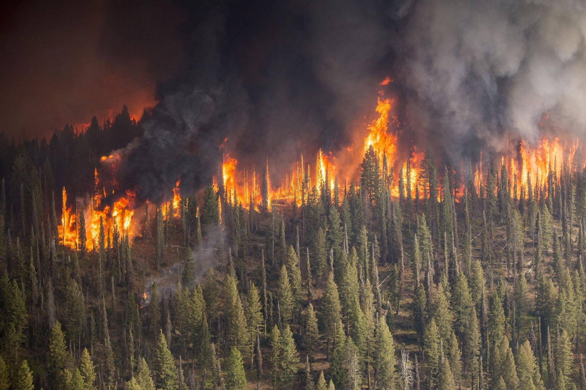
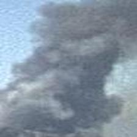
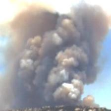
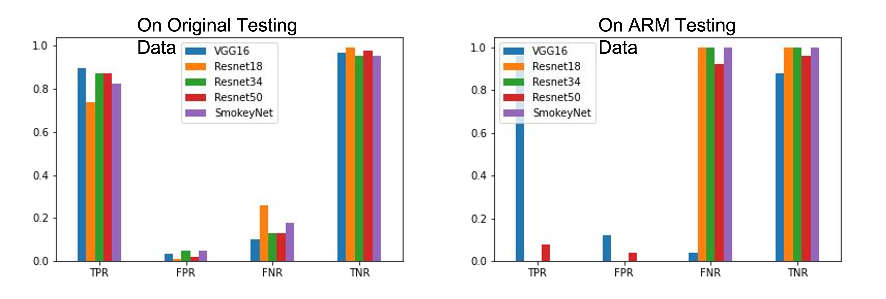

# Wildfire classifier

  

Forest fires are a major problem, and have detrimental effects on the environment. Current solutions to detecting forest fires are not efficient enough, and other machine learning models have far too long computational speeds and poor accuracies. This study is a continuation of the work done by UCSD and their SmokeyNet deep learning architecture for smoke detection[1]. We compared performance of deep learning models, in order to find the best model for this issue, and to find if a simple model can compare to a complex model. The models are: VGG16, UCSD SmokeyNet, Resnet18, Resnet34, and Resnet50.

## The Data

    

    

We utilized wildfire images that have been collected from cameras deployed in San Diego area under HPWREN project[2] and cloud images that had been collected in Singapore under SWIMSEG project[3] because it was difficult to find days when there were clouds in the HPWREN images. We divided the images into 16 pathes because the original image size is much greater than what the models required as input size, and the wildfire smokes are detected in a small area on images. We created a dataset of 41,000 images, comprised of many different wildfire events from HPWREN. The images above are sampled ones of sky, ground, and horizon (first raw, from left to right), cloud and smoke (second raw, from left to right). We organized the images into three different format of classes: 1) split into 5 different classes -- sky, ground, horizon, cloud, and smoke, 2) split into 3 different classes -- smoke, cloud, and other, and 3) split into 2 different classes -- smoke and other.

Because the camera was set to watch a fixed scene, there was no recognizable difference on sky, ground, and horizon images. To build robust model that is able to distinguish smoke and cloud from other in other locations, it would be recommended to add various other images such as forest and snow-covered mountain.

## Approach and Results

We trained the models with the three different class groups and compared performance in terms of false positive rate (FPR), true positive rate (TPR), false negative rate (FNR), and true negative rate (TNR) as shown in the below image.

  

We found that the best results are when sky, ground, and horizon are grouped together as other, and smoke and cloud are left separate. In our case, the most important indicator is FNR because our goal is to reduce false wildfire alarm when this application is deployed at the area where they have mideum to high possibility of occuring wildfires and support local fire departments and foreset preservers for rapid response. As you can see in the table, it is very distinctive that the FNR is very low on VGG16 with 3 classes -- smoke, cloud, and other.

  

We wanted to ensure that the model wasn't completely overfitting to the HPWREN images but learnt something about smoke and cloud. So we also tested it on images from ond of ARM data collection sites to test the models with different background such as sky, ground, and horizon. The bar graph above is showing the classification result of each patches using original test images, which we also generated from HPWREN data, and ARM data. Must keep in mind that the burning event was not very obvious in the ARM testing data, but it won’t always be cut and clear, so it is a great test to see which model perform best with the least.
With a low FPR, the VGG16 model had the best results on the ARM Data as well.

The classifier was able to detect smoke patches accurately from images collected from two different sites. Currently, the plugin is released to be used at the nodes deployed at the mountain region.

## Future Steps

For this work, we created a large dataset and open for public for any related research for future research such as for better model creation. It is needed to explore the dataset more ways to augment the images, by scaling the contrast levels, etc, as this would be a good way to separate smoke from cloud from other. Through this experiments, we found that a simple model can be acceptably accurate and can compare to a complex model. We are hoping that this research can greatly help the fight against forest fires, in order to at one point support the problem solving of forest fires, by being able to attend to them before they get out of control.

## Citations
[1] Dewangan, A., Pande, Y., Braun, H.W., Vernon, F., Perez, I., Altintas, I., Cottrell, G.W. and Nguyen, M.H., 2022. FIgLib & SmokeyNet: Dataset and deep learning model for real-time wildland fire smoke detection. Remote Sensing, 14(4), p.1007. 

[2] https://hpwren.ucsd.edu

[3] http://vintage.winklerbros.net/swimseg.html
