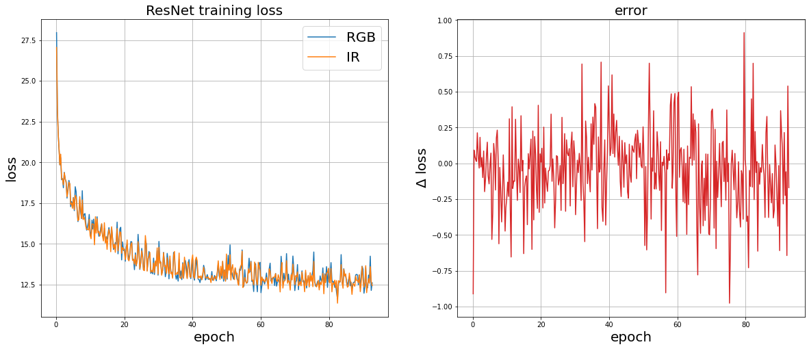
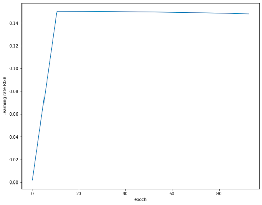
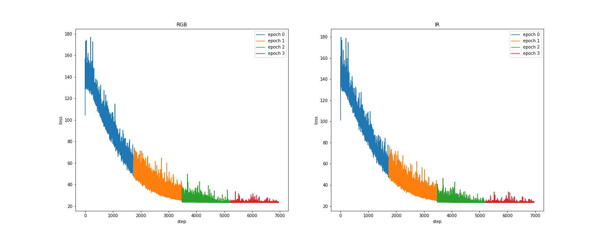
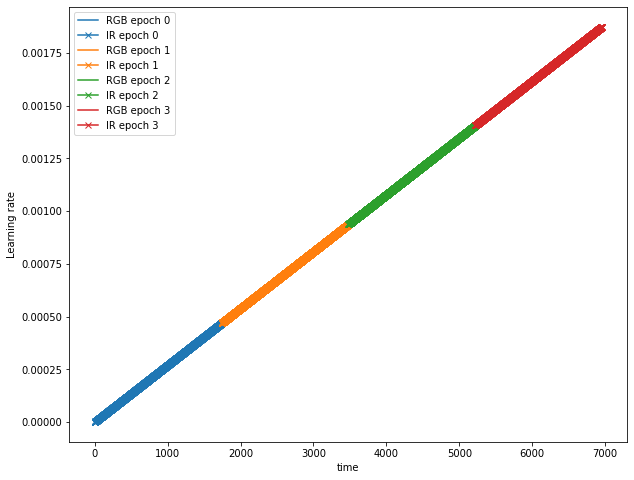

# Daily logs

Link to my [meeting notes](https://docs.google.com/document/d/1LRnpN_eE1WZ5-LrI0CYndENyy3PiCGERJvU9nurvOXs/edit?usp=sharing)


## Week 06/19 -- 06/25

### 06/23 Fri

- Automated the attention map generation step.
- Visually inspected some attention maps generated and found the `checkpoint_vit_rgb16_ir8` performed fairly well!
- Started training with smaller patches (`vit_rgb16_ir4_bs128_ep150`) on 6 nodes and `vit_small` architecture (`vitsmall_rgb16_ir8_bs128_ep150`)
on 2 nodes.
- Will need to check whether the training will run into not enough memory issue.
- Discussed with Dario about DINO training, will finalize it on Monday.
  - Train with 3-channel RGB + artificial 3-channel IR images. The 3-ch IR is made by separating temperate into three bins.
  - Need to put cloud into one bins. Will talk to Bhupendra about possible cloud temperature.
  - Training strategy
    - Training alternatively with RGB and IR images, and alternating the image type for both branches at the same time.
    - Train two models: RGB teacher + IR student, and IR teacher + RGB student

### 06/22 Thu

- Presented at the week meeting [Link](https://docs.google.com/presentation/d/1Oqt4WQ0bol99NMFtKYLR8YZGVwwUif35_zIo5Mjw0L4/edit?usp=sharing)
- Work on visualization and clusterization
- Got TSNE plots with PCA reduction
- Automated the embedding generation process
- Found there was a jump on learning rate for `checkpoint_vit_rgb16_ir8`, which could be caused by changing training epoch from 100 to 150
this changed the optimizer schedule. DO NOT change training epoch after the training started!

### 06/21 Wed

- The distributed training worked! Here are the changes made to add MPI:

1. For training code, before import `init_dist_mode` function or any MPI/NCCL initialization,
add this code

```py
try:
    os.environ['CUDA_VISIBLE_DEVICES']=os.environ['OMPI_COMM_WORLD_LOCAL_RANK']
except:
    print('Not OMPI_COMM_WORLD_LOCAL_RANK in this run!')
```

2. Then, use `utils.py` included in `self_supervised_bird_analysis` 
[Github link](https://github.com/dariodematties/self_supervised_bird_analysis/blob/main/utils.py)
3. Make sure MPI library is installed inside the container and is compatible with host system
MPI library. MPI ranks must be one rank per hardware thread (nproc x num_nodes).
4. Test it with multi-nodes!

- With a working MPI, can now train bigger model. Started to train `vit_rgb16_ir8_bs128_ep150`
- Document the workflow

### 06/20 Tue

- Continued to refine the workflow with some details on the template file, adding more macro options
- Started to work on the distributed memory training. Initially would like to use NVidia NCCL library
because it was built-in for CUDA but Dario has a working version of CUDA+MPI, so I will start to test
the working MPI solution first.

### 06/19 Mon

- Refine ML training workflow
  - Wrote a template with Macros to submit jobs
  - Wrote a python script to substitute macros in template with input and create target training directory
  - Reorganize data repository to standardize file access
- Now, the ML training process has a standardized, reproducible workflow with isolated directory to hold
model in the training as well as evaluation data.
- The environment is reproducible with the help of singularity container
- Data can be trackable with the pair index files.
- Working on parallelizing the training into multiple nodes


## Week 06/12 -- 06/18

## 06/16 Fri

- Use DINO's `visualize_attention.py` to generate attention map and there are three heads for `vit_tiny` architecture
- The resolution for IR is too low, so reduce the patch size for IR images while keep patch size for RGB the same
- There will be lots of training, so need to refine the whole workflow and keep track of everything.
- Started to train `vit_tiny` with RGB patch size 16, IR 8, and batch size 128. `checkpoint_vit_rgb16_ir8`

## 06/15 Thursday

- Presented at the [weekly meeting](https://docs.google.com/presentation/d/1zUZoETjtCwAetGjYBYzTIRs_4WDyj9cckZk5EvsfaQI/edit?usp=sharing)
- Made some visualization
  - Corner plots to show internal relationship between parameters
  - Attention maps from Vision transformers
- the resolution for IR image is low so the patch size must be smaller to create high
resolution attention map. But this created memory problem because smaller patches will
yield more blocks to train on and thus single node does not
have enough to fit both models and smaller patches. Need to use multi-node with distributed memory.


### 06/14 Wed

- Removed one model from the training so we just need to calculate loss and backpropagate for one model. The training will be more efficient
- Start to calculate embeddings for the test sample
- Got attention maps from vision transformer, but it didn't present any information?

### 06/13 Tue

- Found two image issues:
  1. Images before ~03/14 didn't have positions attached to their file names. Solution: Leave the files here.
  2. Some images (~2000) have discrepancy between position reported on RGB files (`.jpg`) and thermal files (`.csv`). There are two
plugins trying to take images causing a race condition. The image pair is technically correct, but one of the position is wrong because
one plugin tries to move the camera continuously and the other one is taking images disrupting the position recording. Solution:
move those files to `bad_pairs` directory, so they don't interfere with the training/testing
- Found another potential issue with the current implementation of the framework:
  - backpropagation might be incorrect because the two branches had two different models. Checked this one, and from the original paper
this shouldn't be a issue as the derivatives for `x` and `y` branches in their implementation are calculated back.
  - However, the current implementation has a duplicate model as the two models (IR and RGB) learn the same information. I will remove one
model before next training. I evaluated the two models and found them identical by comparing embeddings
- Now, data is ready and models are ready too for evaluation.

### 06/12 Mon

- ALCF is offline, so I have to wait
- Worked on a paper on reproducibility to be published
- Read DINOv2 paper

## Week 06/05 -- 06/11

### 06/09 Fri

- Continued the training for VICReg + ViT to ensure both models (ResNet and ViT) have 150 training epochs
- Evaluate the trained models using the embedding vector for new images.
- Discussed with Dario about next steps
  - for DINO, separate thermal IR images into three channels by setting temperature threshold
  - for all-sky camera, refer to [05/31](#0531-wed), and [this section](#cloud_pred).
- Downloaded new images, and optimized the processing workflow to build index cache. This should make the processing 
and pair-creating much faster.
- TODO: show some clusterization results next week

### 06/08 Thu

- Presented at the group meeting
- Chose to use DINO's vision transformer, will document this thing
- Tested ViT in VICReg with the current modifications
- Start to train VICReg + ViT, and continue training VICReg + ResNet
- Assembling a testing and validation dataset to evaluate these two models and do clusterization analysis

### 06/07 Wed

- Came to two realizations for Vision Transformers (ViT)
  - Augmentation is the human prior for network. The feature destroyed in
augmentation process should be things we don't care
  - Training dataset construction is very critical, which dictates the attention of the network
- Trained VICReg + ResNet-50 on a full-node. Training loss and learning rate are shown below.
- Start to swap in ViT to the model part and test using a single thread training.
  - Somehow the hugging-face implementation "official" for ViT does **not** work
  - DINO's vision transformer, claimed to be taken from above, does work!




### 06/06 Tue

- Modified `DataLoader` to fit the containerized training environment,
as there are volume binding that changed the original file path
- Tested the containerized training environment. This should conclude
the development for VICReg preprocessing and training, now move to change
the model
- Started to train VICReg with ResNet-50 on `full-node` queue
- Challenged by the batch system on ThetaGPU system, `cobalt` is an imposter
batch system using the "same" syntax as the more popular `PBS` batch job
management system.

### 06/05 Mon

- Truncated the rgb image to similar FoV as the thermal camera and downsampled
the image to reduce its size.
- Tested the training on both single-gpu and single-node with 8 gpus
- Maximum batch-size for 8 gpu on  the `full-node` queue is 128
- Wrote `.def` to create singularity image for training
- Can use conda to setup the environment as well, need to decide later.

## Week 05/29 -- 06/04

### 06/02 Fri

- Attended DSL seminar for a review and discussion of recent update on Scientific Machine Learning.
Unsupervised LG-Net might be interesting to consider for solving well-posed PDEs
- Attempted to train the modified VICReg using a single GPU but have to modify the batch size. This 
likely would yield a meaningless results as the batch size is too small (4) to fit into single GPU.
- Discussed with Dario and found out the training was too slow and not useful as aforementioned.
- After the discussion, there are three things to do:
  1. Parallelize the current single thread VICReg
  2. Increase the batch size. This can be done after parallelization
  3. Download more image data. Now only have 7000 images but would need more.
  images are being downloaded right now to ALCF.





### 06/01 Thu

- Make the Quad chart!
- Changed the VICReg model to fit two different inputs
  - Two instances of the same architecture (i.e., ResNet) -- done
  - Two different architectures -- TODO
- Need to modify the loss function in order to back-propagate to both branches
- Finished the modification today and successfully ran the code on a single GPU

### 05/31 Wed

- Finished implementing the dataloader for sage images data, now the loader works
- Tested the loading function with a single-gpu and it works without distribution package, i.e., do it sequentially.
- <a id="cloud_pred"></a>Discussed with Dario about the cloud prediction project using all-sky camera, and Dario suggested two frameworks:
  - Two component: Joint embedding architecture (JEA) + single transformer fed with embedding vector from the JEA. JEA for image characterization, while the second transformer is for prediction. See this two papers: [DETR](https://arxiv.org/abs/2005.12872), [I-JEPA](https://arxiv.org/abs/2301.08243)
  - Single component: JEA but with two branches feeding different time of the sky image to let one NN model (current image + time input) match the embedding vector of that of the other NN model with future image.
- TODO: switch out ResNet and make sure the training works with a single gpu before putting the large scale training.
- Will continue to download more SAGE data for training.

### 05/30 Tue

- Transferred local data to ALCF
- Attended the software sustainability seminar
- Data loader and reader look fine but still has issue with multiprocessing, will look into it tomorrow.
- 03/10 - 03/24 data has been downloaded.
- The data format is
  - original unmodified JPG RGB images are in `rgb` directory
  - processed JPG images with only left half (optical images) are in `processed` folder under `rgb` directory
  - thermal images in `.csv` file with celsius degree per pixel are in `thermal` folder
  - metadata files created from querying using `sage_data_client` are in `sage_meta` folder
  - to check data consistency, I created a txt file for each JPG & thermal image pair and put them in `pairs` folder, and put in directories with SAGE node name.

### 05/29 Mon

Memorial day, no work.

## Week 05/22 -- 05/28

### 05/26 Fri

- Finally got access to ALCF!
- Migrated the workflow to ALCF
- Continued to change the input to fit into VICReg framework
- Acquired username and password from Raj to access the private node images

### 05/25 Thu

- Downloaded imaging data based on links in metadata files
- Send Bhupendra a list of URLs to files I cannot download due to a credential issue.
- Tweak the framework to change the input from single input with augmentation to two inputs (optical RGB + thermal IR).
- Still don’t have access to ALCF yet, so will try to use google colab for testing
- The W056 node physical location changed from ANL to San Deigo around 05/20/2023, so there might be some changes in the image quality
- Daytime and night time calculations for each node would need the physical location information to get the timezone. This hasn’t been done yet!

### 05/24 Wed

- Checked the VICReg framework and discussed the detail with Dario
- Automated the data downloading process
- Reformated the downloaded images for training
- Splitted the JPG images to left RGB + right thermal images. (only keep the RGB images)

### 05/23 Tue

- Continued to refine the scope of the project
- Downloaded sage node data but there was an issue with credential to download data
- Inspected the sage node data and developed method to extract specific image
- Getting access to ALCF theta

### 05/22 Mon

- Attended orientation
- Met with Dario and Bhupendra to discuss the project detail
- Discussed the SAGE node data format
  - 4 pointing per column (1, 5, 9,13, …)
  - A total of 32 pointing positions and 8 are pointing sky
  - Client code: https://github.com/RBhupi/sage-data-client
  - Data web: https://portal.sagecontinuum.org/ (use ANL to login)
  - Data model is a CSV file with “celsius” per pixel at each position (read the head to understand that)
  - A sample code to query: ​​https://github.com/RBhupi/Konza_Mobo_Analysis/blob/main/mobo_data_download_nc.py
  - Figure out how many images are available at each position and what’s the production rate for each position
  - Want “thermal.celsius.csv” in file name.
